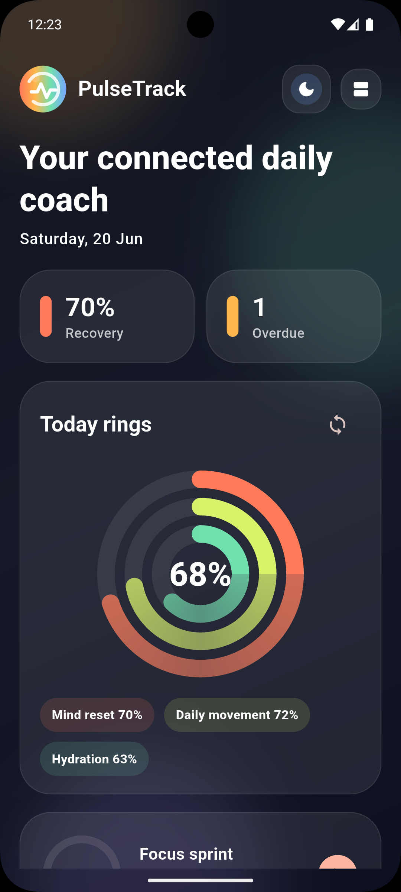
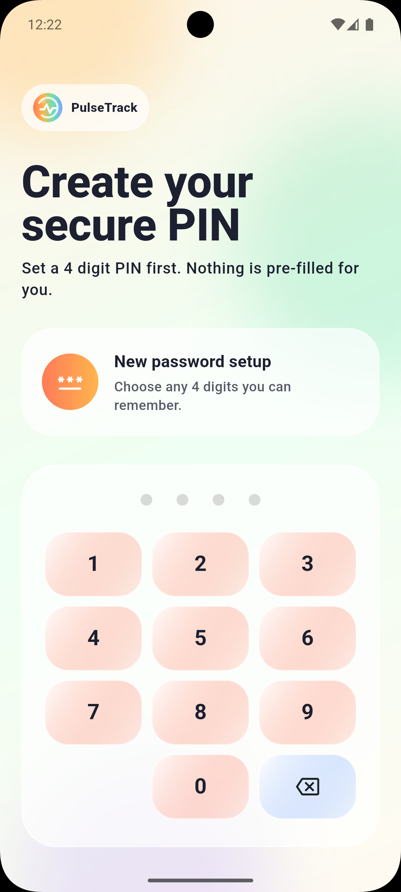
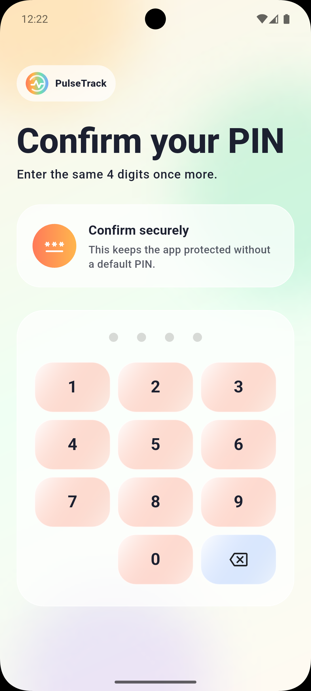
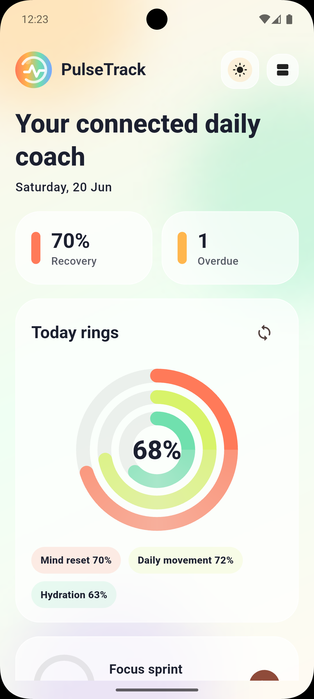
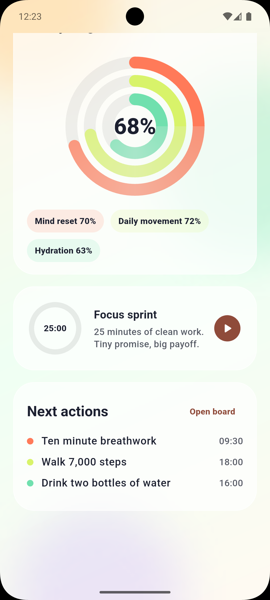
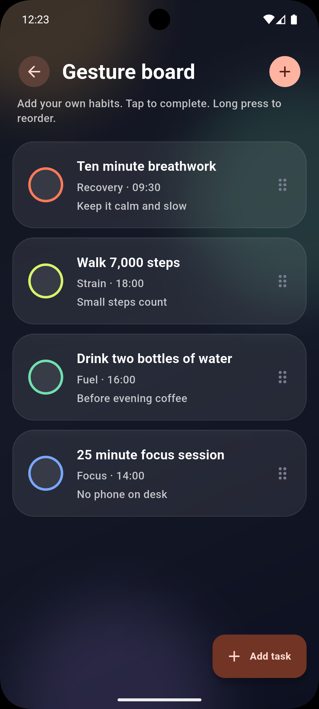
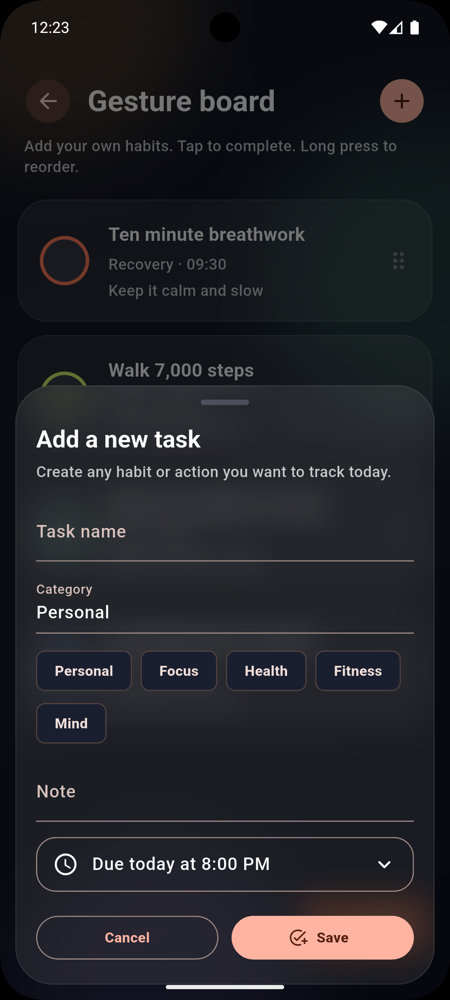

# PulseTrack

PulseTrack is a smart habit and focus tracking mobile app built with Flutter.
It helps users create daily habits, manage focus tasks, track progress visually, and stay consistent with a clean animated dashboard.

<p align="center">
  
</p>

<p align="center">
  <b>Smart Habit Tracker · Focus Timer · Secure Login · Animated Progress Dashboard</b>
</p>

---

## Demo Video

Watch the complete app flow here:

[▶ Watch PulseTrack Demo](docs/demo/demo.mp4)

---

## App Preview

<table>
  <tr>
    <td align="center">
      
      <br />
      <b>Splash / Welcome</b>
    </td>
    <td align="center">
      
      <br />
      <b>PIN Setup</b>
    </td>
    <td align="center">
      
      <br />
      <b>Authentication</b>
    </td>
  </tr>
  <tr>
    <td align="center">
      
      <br />
      <b>Dashboard</b>
    </td>
    <td align="center">
      
      <br />
      <b>Habit Board</b>
    </td>
    <td align="center">
      
      <br />
      <b>Add Custom Task</b>
    </td>
  </tr>
</table>

<p align="center">
  
  <br />
  <b>Dark Mode / Focus Experience</b>
</p>

---

## What is PulseTrack?

PulseTrack is designed for users who want to improve their daily discipline and productivity.
Users can add their own habits, complete daily tasks, track progress with animated rings, and use a Pomodoro-style focus timer.

The app also includes secure access with PIN and biometric authentication, so personal habit data stays protected.

---

## Main Features

* Add custom daily habits and tasks
* Mark tasks as completed
* Reorder habit cards with drag interaction
* Delete tasks when no longer needed
* Animated progress dashboard
* Activity rings inspired by health tracking apps
* Pomodoro focus timer
* PIN setup on first launch
* Biometric authentication support
* Light and dark theme switching
* Smooth page transition animations
* Local data persistence using Hive
* Native haptic feedback using platform channels
* Deep link handling structure
* Background sync structure for overdue habits

---

## Tech Stack

* Flutter
* Dart
* GetX
* Hive
* Clean Architecture
* MethodChannel
* EventChannel
* Swift
* Kotlin
* Android WorkManager
* iOS BackgroundTasks

---

## Project Structure

```text
lib/
├── core/
│   ├── middleware/
│   ├── routes/
│   ├── services/
│   └── theme/
│
├── data/
│   ├── models/
│   └── repositories/
│
├── domain/
│   └── use_cases/
│
├── presentation/
│   ├── auth/
│   ├── dashboard/
│   ├── splash/
│   └── tasks/
│
└── main.dart
```

---

## Screenshots and Demo Files

```text
docs/
├── screenshots/
│   ├── ss1.png
│   ├── ss2.png
│   ├── ss3.png
│   ├── ss4.png
│   ├── ss5.png
│   ├── ss6.png
│   └── ss7.png
│
└── demo/
    └── demo.mp4
```

---

## Getting Started

### 1. Clone the repository

```bash
git clone <your-repository-url>
cd pulsetrack_source
```

### 2. Install dependencies

```bash
flutter pub get
```

### 3. Run the app

```bash
flutter run
```

---

## Android Setup

Make sure Android SDK and NDK are installed properly.

Recommended setup:

```text
compileSdk: 36
targetSdk: 36
ndkVersion: 27.0.12077973
```

If multiple Gradle files are created by Flutter, remove unused `.kts` files if your project is using normal `.gradle` files.

```bash
rm -f android/build.gradle.kts android/settings.gradle.kts android/app/build.gradle.kts
```

---

## iOS Setup

Install pods before running on iOS:

```bash
cd ios
pod install --repo-update
cd ..
flutter run
```

For background task support, enable Background Modes capability in Xcode.

---

## App Flow

1. User opens the app.
2. User sets a 4-digit PIN on first launch.
3. If biometric authentication is available, the app asks whether the user wants to enable it.
4. User reaches the dashboard.
5. Dashboard shows habit progress and focus status.
6. User can open the task board.
7. User can add custom habits or tasks.
8. User can complete, reorder, or delete tasks.
9. Progress updates automatically.
10. Theme can be switched between light and dark mode.

---

## Why This App?

Most productivity apps either focus only on tasks or only on timers.
PulseTrack combines habits, focus sessions, progress visualization, secure access, and smooth mobile interactions in one experience.

The goal is to make habit tracking feel simple, visual, and motivating.

---

## Future Improvements

* Cloud sync
* User profile
* Weekly and monthly analytics
* Streak tracking
* Push notifications
* Home screen widgets
* Better focus session reports
* Habit categories and reminders

---

## Author

Built with Flutter for smart habit and focus tracking.
